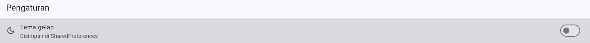
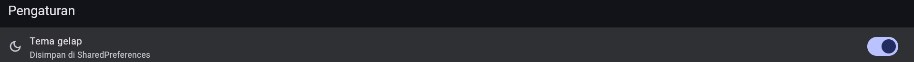
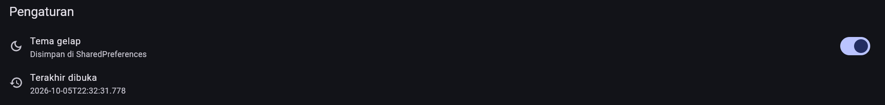

# Week 6
Raymon Devtant
TI-3C
Praktikum 1

Membuat project baru

Download package

Create Struktur Folder

Tema Terang

Tema Gelap

Terakhir Dibuka

TerakhirDibukaDanTemaGelap

Pertanyaan Praktikum 1
1. Karena jika di simpan di build sering terjadi re-rendered atau panggilan berulan terus menerus
sehingga bisa memicu infinite loop
2. Pertama user menekan switch lalu mengubah value boolean jika true akan diubah gelap
   Kedua nilai akan di kirim ke prefs.dart lalu disitulah prefs.dart akan mengubah tema jadi gelap/terang
   Ketiga saat berubah ke darkmode maka di main akan load themedmode darkmode dan sebaliknya
   Keempat data itu akan di simpan ke storage menggunakan sharedpreferences dimana nanti ia akan mengirimkan value data 
   secara berpasangan yaitu variable dan valuenya
   Kelima data akan tersimpan di storage/disk dan saat kita membuka aplikasi kembali maka terakhir dibuka akan berubah dan darkmode/lightmode akan sama dan tidak berubah seperti saat kita close aplikasi 
3. Kelebihan:
   - UI sangat responsif jadi perubahan tema terasa instant
   - Aplikasi lebih ringan karena tidak ada loading indicator setiap kali user menekan switch
   Kekurangan:
   - Inkonsistensi data dimana jika kita gagal mengiriim data ke storage tampilan UI akan berganti namun data di storage belum berubah
   - Kompleksitas rollback pengembang harus menyediakan mekanisme untuk membatalkan perubahan UI jika sistem gagal menyimpan
   perubahan di storage 
   - Kondisi balapan dimana jika user menekan switch dengan cepat ada kemungkinan data yang tidak sinkron dimana data bisa saling mendahului yang bisa membuat hasil akhir di UI dan data yang disimpan di storage berbeda

Praktikum 2
1. Karena sqlite tidak memiliki tipe data boolean jadi kita menggunakan tipe data dirty
2. Agar test bisa menyuntikkan database palsu atau in-memory tanpa menyentuh SQLite sungguhan (dependency injection). Pola ini dipakai di Praktikum 5 dan akan dipakai lagi pada Minggu 12 (Testing & QA).
3. Agar nilai tidak pernah digabung langsung ke string SQL sehingga aman dari SQL injection.
4. Maka perangkat yang sudah memiliki database lama tidak akan mendapatkan kolom baru

Praktikum 3

Pertanyaan
1. Ketika terjadi mutasi (seperti membuat, mengubah, atau menghapus catatan), data pada daftar catatan (notes) dan jumlah data yang belum tersinkronisasi (dirty count) sama-sama berubah di database lokal. Mengabaikan/meng-invalidate kedua provider ini memicu Riverpod untuk membaca ulang data terbaru dari SQLite secara otomatis sehingga UI selalu sinkron secara real-time.
   Jika hanya notesProvider: Daftar catatan di layar utama akan diperbarui (misal: catatan baru muncul), tetapi indikator badge atau status sync di header/appbar (dirty count) akan menampilkan angka lama (stale/outdated UI).
   Jika hanya dirtyCountProvider: Angka indikator jumlah pending sync akan bertambah/berkurang, tetapi daftar catatan di layar utama tidak merefleksikan perubahan (misal: catatan yang didelete masih muncul di layar sampai halaman di-refresh manual).
2. Ada 3 cara memicu error:
   1. Mengubah nama tabel (Query Error): Ubah nama tabel di dalam query repository secara sengaja, misal mengganti db.query('notes') menjadi db.query('invalid_table').
   2. Throw Exception Manual: Tambahkan throw Exception('Sengaja error untuk testing UI'); di baris pertama fungsi fetchNotes() pada repository atau controller provider.
   3. Mengubah tipe data/parsing error: Ubah hasil kembalian mock/database agar gagal saat diparsing oleh method Note.fromMap().
3. Karena aplikasi ini menerapkan pendekatan Offline-First. Seluruh operasi baca dan tulis (CRUD) dilakukan langsung ke database lokal (SQLite) yang tersimpan di memori perangkat, bukan ke server/API internet. Kehadiran koneksi internet atau mode pesawat tidak memengaruhi kemampuan aplikasi membaca dan menulis ke disk lokal. Flag dirty: true hanya bertugas menandai baris data yang nantinya perlu disinkronkan saat koneksi internet tersedia.

Praktikum 4

Pertanyaan
1. Cahce first: Aplikasi akan mengecheck cache terlebih dahulu dan menampilkan data cache jika ada, jika cache kosong maka data
   akan diambil dari network, dan saat proses background update
   Network first: Aplikasi mengambil data ke network terlebih dahulu, jika gagal barulah aplikasi mengambil data cache
   Contoh network first: E-wallet karena data keuangan sangat sensitif terhadap keakuratan realtime. Menggunakan cache-first berisiko menampilkan angka saldo lama yang salah (stale data), sehingga pengguna bisa melakukan transaksi yang gagal atau melebih batas.
2. Skenario: Jika pengguna mengubah catatan selama upload berlangsung, perubahan itu ikut ditandai bersih padahal belum terkirim.
   Perbaikan: tandai bersih berdasarkan daftar id + updated_at yang benar-benar dikirim.
3. Untuk testing: Memudahkan developer mematikan koneksi secara simulasi langsung di dalam aplikasi tanpa harus mengganggu koneksi internet seluruh komputer/emulator atau mematikan Wi-Fi.
   Untuk user: Memberikan kontrol penuh kepada pengguna jika ingin menghemat kuota data atau sengaja tidak ingin menyinkronkan data ke server untuk sementara waktu.
4. Untuk atomisitas: Memastikan seluruh batch data dari server tersimpan secara utuh. Jika terjadi kegagalan/interupsi di tengah penulisan, transaksi akan di-rollback sehingga database lokal tidak berada dalam kondisi rusak atau parsial.
   Untuk performa penulisan: Menjalankan banyak perintah insert/update di dalam satu transaksi jauh lebih cepat pada SQLite daripada melakukan eksekusi penulisan secara terpisah satu per satu.

Praktikum 5

Pertanyaan 
1. Kecepatan & Isolasi Pengujian: Membaca database SQLite asli memerlukan I/O file disk yang lambat dan berat. Menggunakan ProviderContainer 
   dengan overrideWithValue memasukkan repository palsu (mock/fake repository) yang berjalan di memori (in-memory), sehingga unit test 
   dieksekusi secara instan (dalam hitungan milidetik).
   Determinisme & Mencegah Side Effect: Database asli dapat menyimpan state yang tidak konsisten antar pengujian (misalnya data sisa dari pengujian sebelumnya). Dengan repository palsu, state awal selalu bersih, terkontrol, dan dapat disimulasikan sesuai kebutuhan (seperti mensimulasikan kondisi database error/terkunci).
   Independensi Lingkungan (Environment Independent): Pengujian dapat dijalankan di lingkungan CI/CD pipeline atau mesin tanpa akses file system / plugin native SQLite SQLite/sqflite tanpa takut gagal karena masalah ketergantungan platform (native dependencies).
2. Simulasi Kondisi Jaringan Nyata: Memungkinkan penguji mensimulasikan keterlambatan jaringan (network delay/lag) secara presisi tanpa perlu 
   melakukan delay buatan yang lambat di pengujian utama.
   Mempercepat Eksekusi Unit Test: Dengan menyetel latency: Duration.zero pada test, fungsi sinkronisasi tidak perlu menunggu delay waktu nyata, sehingga seluruh rangkaian pengujian selesai dengan sangat cepat.
   Pengujian Fitur Asinkron & UI State (Loading Indicator): Memungkinkan pengujian state loading pada UI dengan memberikan nilai latency positif (misalnya Duration(milliseconds: 500)), lalu memverifikasi apakah indikator loading/spinner muncul saat proses sinkronisasi sedang berlangsung.
3. Test untun menguji bahwa syncNotes tidak melakukan apa-apa (0 sinkronisasi) dan tidak memanggil API/repository jika tidak ada catatan yang 
   bertanda dirty (dirty: false).
   Alasan: Untuk memastikan efisiensi sumber daya dan kuota jaringan. Dalam arsitektur offline-first, aplikasi tidak boleh membuang-buang koneksi internet atau beban pemrosesan server untuk mengirim data yang sudah sinkron (tidak ada perubahan lokal). Pengujian ini menjamin bahwa fungsi sync memiliki logika pengecekan awal (early return) yang benar.

AI challenge

AI verification
1. Tidak. AI menempatkan SharedPreferences hanya untuk preferensi tema (data key-value tunggal/sederhana), dan secara tegas memilih Drift untuk pengelolaan daftar catatan (koleksi 1000+ data).
2. Mendukung sebagian, Skema mencakup kolom updated_at dan created_at pada tabel Notes. tetapi belum menyediakan dirty flag khusus (seperti boolean is_synced atau is_dirty) maupun soft delete (deleted_at)
3. Didukung secara konkrit oleh Drift (watch). Drift secara native menyediakan API watch() (misalnya select(notes).watch()) yang menghasilkan Stream<List<Note>>.
4. Masuk akal. Estimasi diset ke Sedang untuk Drift. Hal ini akurat karena Drift membutuhkan beberapa paket dependency (drift, sqlite3_flutter_libs, drift_dev, build_runner), pembuatan skema tabel dalam bahasa Dart, serta eksekusi code generation via dart run build_runner build.
Untuk migrasi skema, Drift menyediakan MigrationStrategy (onUpgrade) yang mempermudah migrasi versi skema dibanding mengelola raw SQL di sqflite.
5. Setuju dengan rekomendasi AI. Preferensi Tema: SharedPreferences — Penggunaan yang paling efisien, minim konfigurasi, dan tidak memerlukan overhead database relasional. 1000+ Catatan: Drift — SQLite melayani dataset besar di disk dengan indeksasi cepat, sementara layer Drift memberikan proteksi compile-time type-safety dan reaktivitas stream yang sangat baik untuk antarmuka Flutter.

Tabel per bandingan storage
| Kriteria | SharedPreferences |	Hive	| sqflite |	Drift |
| --- | --- | --- | --- | --- |
| Kompleksitas query | Sangat Rendah (Hanya Key-Value sederhana) | Rendah–Sedang (Filter manual di memori/Box) | Tinggi (Standard SQL: JOIN, LIKE, GROUP BY) | Sangat Tinggi (Dart Fluid Query API & Typed SQL) |
| Dukungan relasi | Tidak ada (Manual via JSON string) | Tidak native (Disimpan sebagai ID & di-resolve manual) | Sangat Baik (Foreign Key & SQL constraints) | Sangat Baik (Relasi divalidasi pada saat kompilasi) |
| Reaktivitas (stream) | Minim (Perlu listener manual / wrapper tambahan) | Sangat Baik (Watch bawaan pada tingkat Box/Key) | Tidak native (Membutuhkan wrapper manual StreamController) | Sangat Baik (Mendukung method watch() bawaan untuk Stream UI) |			
| Type-safety | Rendah (Pemeriksaan tipe manual pada runtime) | Sedang (Membutuhkan TypeAdapter dan TypeId) | Rendah (Pengembalian berupa Map<String, dynamic> mentah) | Sangat Tinggi (Data class dan companion class di-generate otomatis) |
| Ukuran boilerplate | Sangat Kecil (Langsung pakai tanpa generator) | Kecil–Sedang (Membutuhkan TypeAdapter & build_runner) | Sedang–Tinggi (Menulis query raw SQL & mapping manual) | Sedang (Membutuhkan file definisi skema & build_runner) |
| Kemudahan testing | Sangat Mudah (Menggunakan setMockInitialValues) | Sangat Mudah (Hanya perlu Hiveinit di direktori temp) | Sedang (Membutuhkan mock / konfigurasi in-memory SQLite) | Sangat Mudah (Mendukung NativeDatabasememory() secara native) |			
| Cocok untuk preferensi? | Sangat Cocok | BISA (Overkill) | TIDAK (Terlalu Kompleks) | TIDAK (Terlalu Kompleks) |
| Cocok untuk 1000+ catatan? | TIDAK | BISA (Terbatas) | Sangat Cocok | Sangat Cocok |		
| Keputusan | DIPILIH untuk Preferensi Tema | TIDAK DIPILIH | TIDAK DIPILIH | DIPILIH untuk 1000+ Catatan |
| Alasan | Sangat ringan, berbasis key-value sederhana, dan tidak memerlukan setup skema database. Rapuh dan lambat jika digunakan menyimpan koleksi data besar | Bisa untuk kedua kebutuhan, tapi menyimpan 1000+ catatan di memori (RAM) akan memberatkan perangkat. Query/filtering teks dan relasi tag harus dilakukan manual | Mendukung dataset besar di disk, tapi kurang fleksibel karena tanpa type-safety (raw SQL string) dan perlu wrapper manual untuk mendukung stream/reaktivitas UI | Mendukung query relasional & indeksasi SQLite secara efisien di disk, dilengkapi fitur watch() stream reaktif out-of-the-box, serta jaminan type-safety saat kompilasi |

Pertanyaan Refleksi
1. Karena sharedPreferences dirancang khusus untuk menyimpan data pasangan key-value sederhana (seperti konfigurasi, tema, atau flag status login), bukan untuk struktur data relasional/kompleks seperti daftar catatan. 
   Dampak jika di langgar: Kurangnya fitur query, performa buruk dan blocking ui, resiko data corrupt
2. Chace first cukup jika data jarang berubah, kapan butuh strategi lain seperti network first yaitu saat data sering berubah ubah/realtime contoh nya untuk perubahan nilai mata uang 
3. Proses sinkronisasi dieksekusi di background secara asinkron (misalnya melalui Riverpod FutureProvider/StateNotifier atau worker thread). UI langsung diperbarui dari DB lokal tanpa perlu menunggu response jaringan.
   Kapan tabel outbox jadi perlu Saat tindakan pengguna melibatkan payload khusus, lampiran file/gambar, atau beberapa endpoint API yang harus dikirim bertahap sesuai urutan kejadian (Event Sourcing/Transactional Outbox Pattern).
4. Untuk kasus saya hampir semua saran dari AI tidak saya tolak